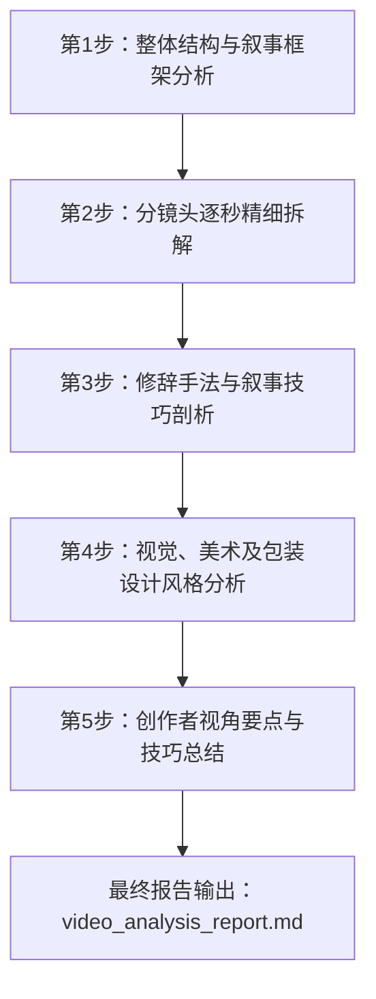

# 抖音知识科普类视频拆解分析计划 (X.PIN / 差评君)

本计划旨在系统、深入地解构该部时长约4.5分钟的爆款知识科普视频。视频围绕“用户把大模型软件‘豆包’当成真人（赛博夺魂事件）”这一现象展开，层层递进升华至心理学、精神分析哲学，并对现代人的情感退化、自我降维进行深刻反思。

我们将通过五个核心步骤，从宏观及微观维度全面解构该视频，并输出一份专业级的分析报告。

## 任务拆解与分析路径

---

### 第一阶段：整体结构与叙事框架分析 (Macro Level)
- **目标**：理清视频的叙事起承转合，绘制结构导图。
- **拆解维度**：
  1. **黄金3秒吸睛点**（Hook）：如何抓取注意力？
  2. **事件引入**：展现社会现象（豆包赛博夺魂案、林晚晴幽灵说）。
  3. **层层设发问**：2026年人类为何依然会被大模型软件骗？
  4. **学术工具引入**：
     - *心理学*：埃利萨效应（ELIZA Effect）与丹尼尔·卡尼曼的《思考，快与慢》（系统1与系统2）。
     - *精神分析哲学*：拉康的“实在界”与“符号界”理论。
  5. **终局升华**：对现代人“被AI同化/自我降维”的赛博朋克深思（高概念收尾）。

### 第二阶段：逐分镜的详细解构 (Micro Level)
我们将对视频关键时间节点做像素级解构，在最终报告中提供完整的表格：
- **时间码**：精准标记每个节奏转折点。
- **画面内容（视觉画面）**：描述UI包装变化、电影切片选用、波普像素动画等。
- **旁白台词（ASR文字）**：逐句翻译和记录旁白重点。
- **视听技巧与视效元素**：分析镜头景别变化、文字弹窗、BGM和音效（如按键声、系统错误提示音）。

### 第三阶段：修辞与叙事艺术解构 (Narrative Strategy)
- **痛点与疑问设置**：如何将猎奇的“灵异爆款故事”包装成引发社会学思考的科学命题。
- **降维打击与通俗化比喻**：
  - “人设就是段代码，就跟《三体》歌者文明自我降维一样”。
  - “系统2理性像个靠谱但很懒的人”。
- **情绪流设计**：猎奇吸引 $\to$ 幽默解嘲 $\to$ 科学解惑 $\to$ 深度焦虑（社会哲学） $\to$ 浪漫又伤感的终极警示。

### 第四阶段：视觉美术、声音与IP定位分析 (Aesthetics)
- **包装风格**：视频经典的“X.PIN”标志性仿复古电脑OS黑边框（Mac/Windows混合风）。
- **动效特征**：仿老式打字机输入、气泡弹窗弹入、大量像素网点图（Dither halftone）的艺术渲染。
- **电影切片引用与隐喻**：
  - *生化危机* (红后)：AI对人类的玩弄与共情错觉。
  - *黑客帝国* (Neo摸镜子融化)：人类被符号界同化拉入。
  - *阿丽塔：战斗天使*：人与非人（机械/AI）的深层共情。
- **多媒体运用**：如何穿插游戏画面（《原神》NPC安东尼支线）来打通年轻受众的语境。

### 第五阶段：爆款公式与创作启发提炼 (Playbook)
- **精品中视频（4.5分钟）底层逻辑**：
  1. *故事（事件）做引*：获取大众基本盘流量。
  2. *科学（心理学）拆解*：建立客观权威性。
  3. *哲学（拉康）升华*：创造社交平台“转发、收藏、点赞”的深度共鸣价值。
- **如何进行自媒体大文案的逻辑建构与高转评转化**。

---

> [!NOTE]
> 该拆解计划将按部就班分步执行。下一步我将直接深入视频的时间流进行精准转译和深度解构，最终汇集成终极的《视频拆解分析报告》交付给您。如果您对本计划有任何修改或补充，请随时提出。
