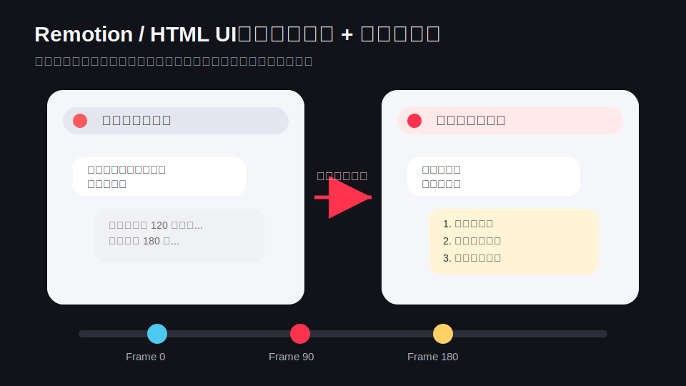
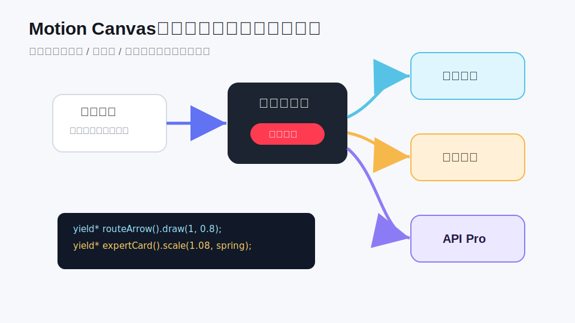
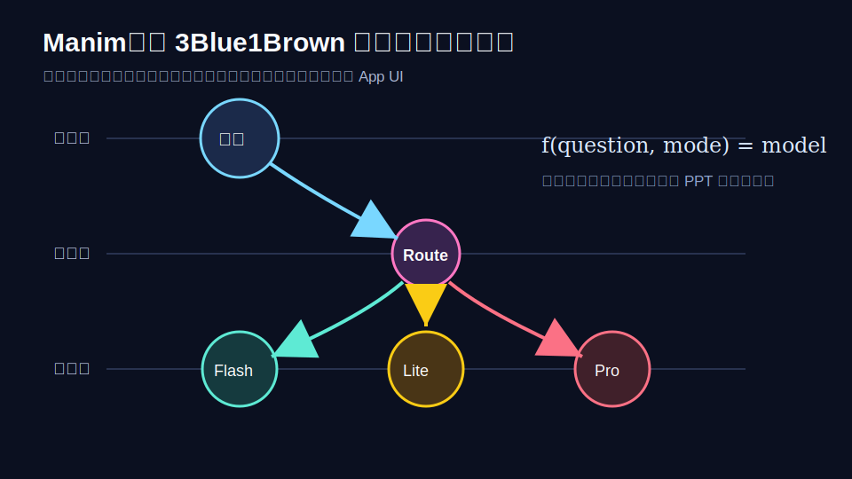
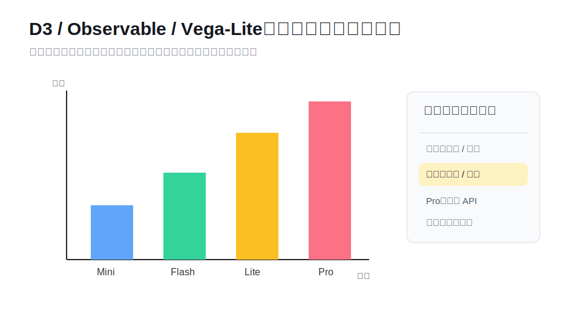
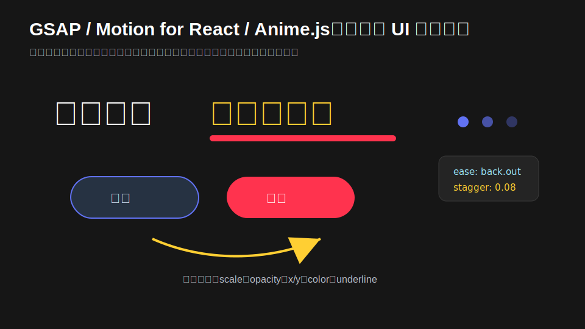
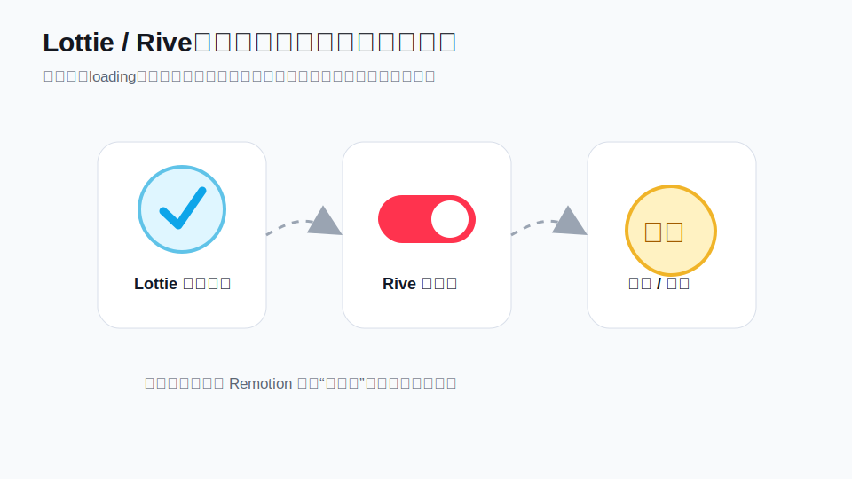
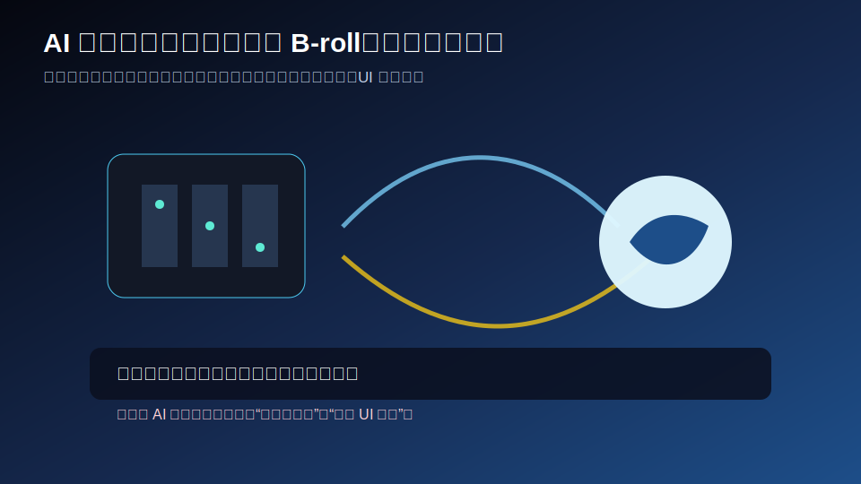
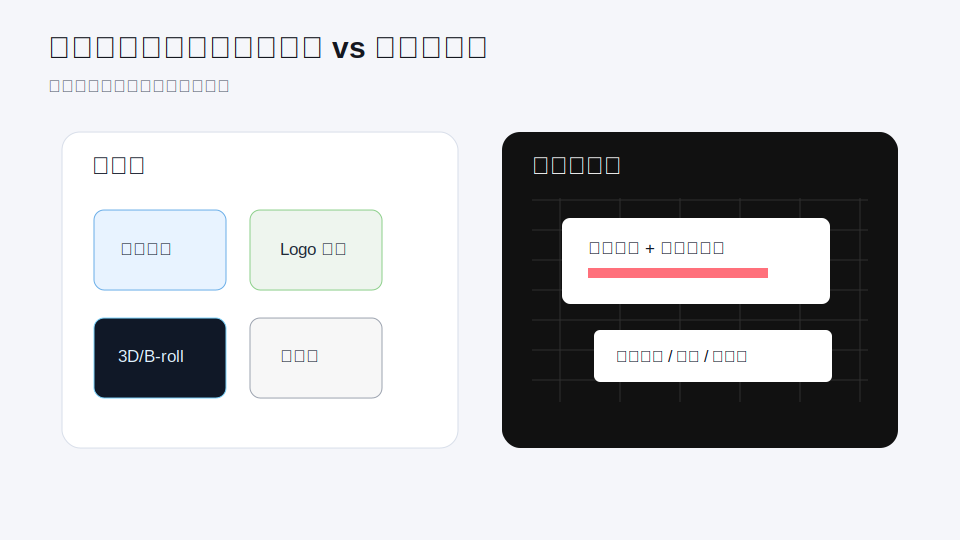

> [!IMPORTANT]
> **修改/新增“省科协科普视频”项目下的任何文件之前，请务必先阅读并严格遵循主导航、标准与协作规则：**
> 1. [项目资源导航与工程标准.md](file:///home/fnckc/AI_workspace/coding/projects/general_chat/省科协科普视频/2026-06-09_22-03_项目资源导航与工程标准.md)
> 2. 项目根目录下的 [GEMINI.md](file:///home/fnckc/AI_workspace/coding/projects/general_chat/GEMINI.md) 与 [AGENTS.md](file:///home/fnckc/AI_workspace/coding/projects/general_chat/AGENTS.md) 协作规则
>
> 必须严格遵守**通俗化子目录边界**，以及**防偏差工程标准（闭环物理动作字典、统一素材 To-Do 协议）**。创建/更新文档时必须严格执行 `GEMINI.md` 中的**北京时间命名规范**。

# AI 视频 motion 库与省科协豆包视频实现调研

创建时间：2026-05-30 17:54（北京时间）
最后更新时间：2026-06-05 11:05（北京时间）
更新次数：5

这次调研的问题很具体：我们现在的 `2026-05-25_11-53_豆包科普视频_shots.csv` 里已经写了很多 motion，比如文字快速入场、左右聊天窗口、镜头推向右侧、产品层/模型层结构图、卡片升起、天平摆动。你担心的是，如果 AI 自动视频工具只会对图片做 zoom in / zoom out，那这个视频会变成“图片轻轻动一下 + 旁白”，画面撑不起来。

结论先说：不是只有 zoom in / zoom out。你看到的那类 motion，只是 faceless video 工具里最低成本的“让静态素材不那么静”的做法，本质接近 Ken Burns 效果。真正要做表格、流程图、卡片、箭头、图层展开、数据变化、UI 对比，应该看的是 motion graphics / 程序化动画库，而不是只看 AI 视频生成器。

对省科协这个豆包视频，最稳的主线不是“找一个万能 AI 视频工具直接生成成片”，而是用 Remotion 做总装，用 HTML/CSS 做 UI 模拟，用 Manim 或 Motion Canvas 做解释性动画，用 D3 / Observable Plot / Vega-Lite 做数据和表格图，再把少量 AI 视频模型用于氛围性 B-roll。这样画面是可控的，事实边界也可控，后面改字、改时间轴、改镜头不会崩。

## 先分清三种完全不同的 motion

第一种是“素材运动”。一张图被慢慢推近、拉远、左右平移，或者一个视频片段加转场。很多 AI 自动视频工具默认做的就是这个。它的优点是快，缺点是只能让画面有动静，不能真正解释复杂关系。VidRush 官方文档也说得很清楚，它是 AI video production platform，不是 motion graphics suite，也不是 manual video editor。它擅长旁白 + B-roll，不负责自定义动画和录屏。

第二种是“图形动画”。比如你的 CSV 里写的“产品层、路由层、模型层三层结构图”“箭头依次点亮”“卡片依次升起”“天平轻微摆动”。这些不是 AI 视频模型擅长的东西，而是 Remotion、Motion Canvas、Manim、GSAP、Lottie、Rive、D3 这类工具的地盘。

第三种是“生成式视频运动”。比如 Runway、Luma、Kling、Pika、可灵、即梦/Seedance 这类工具，根据图片或文字生成一段真的会动的视频。它们适合做机房、电表、餐厅窗口、抽象隐喻这种氛围镜头，但不适合承担“哪一条箭头什么时候亮、表格第几行怎么变黄、两个回答怎么逐条展开”这种精确任务。

## 最值得看的库和工具

| 工具 | 它解决什么 | 适合省科协豆包视频的地方 | 不适合的地方 |
|---|---|---|---|
| Remotion | 用 React 生成真实 MP4 视频 | 总装时间线、字幕、聊天 UI、卡片、标题、镜头推拉、批量改字 | 不是傻瓜式 AI 成片工具，要写代码；商业授权要留意 |
| Motion Canvas | 用 TypeScript 写解释性矢量动画，并配一个实时预览编辑器 | 箭头流动、层级图、卡片、流程图、带旁白同步的解释动画 | 做复杂网页 UI 不如 Remotion / HTML 直接 |
| Manim | Python 程序化解释动画，3Blue1Brown 那套思路 | 模型层/产品层/路由层、成本曲线、数字/箭头/图形推演 | 风格偏数学和解释动画，不适合做丰富 App 界面 |
| D3 | 数据驱动 SVG / HTML 可视化 | 成本阶梯、模型档位、对比图、动态表格、条形图 | 自己写代码较多，视频导出要靠 Remotion/浏览器录制/截图序列 |
| Observable Plot / Vega-Lite | 更高层的数据图表语法 | 快速做清楚的数据图、分层图、对比图 | 动画控制不如 D3 细，复杂动效还要外接渲染流程 |
| GSAP | 强 JavaScript 动画时间线 | SVG morph、文字入场、复杂缓动、网页动效原型 | 在 Remotion 里不能直接依赖浏览器实时 CSS/JS 动画，最好转成帧驱动或预渲染 |
| Motion for React | React UI 动画库，原 Framer Motion 生态 | UI 状态切换、卡片布局变化、按钮高亮、列表重排 | 更偏网页交互，不是视频渲染引擎 |
| Anime.js | 轻量 JS 动画引擎 | 简单文字、SVG、数字、路径动画 | 生态和工程能力不如 GSAP / Remotion 主线 |
| Lottie | After Effects 导出的 JSON 矢量动画格式 | 拿现成图标动画、loading、提示符、装饰性小动效 | 不适合承载核心时间线和复杂数据逻辑 |
| Rive | 可交互矢量动画和状态机 | 做“快速/专家”按钮状态、AI 小图标、多状态角色 | 更偏产品内互动动画，做视频要再录制或导入渲染流程 |
| Three.js | 网页 3D 图形 | 如果要做 3D 模型层、GPU 机房、立体卡片空间 | 当前视频不必上 3D，容易增加复杂度 |
| Blender Python | 可脚本化 3D 场景和动画 | 很想做 3D 机房、电表、餐厅空间时可用 | 对这条 4 分钟科普片来说重了 |
| After Effects / Cavalry | 专业 motion design GUI 工具 | 如果人工做精修，AE 和 Cavalry 的动效能力远超自动视频工具 | 不适合完全自动化；AE 也有订阅和工程文件协作成本 |
| HyperFrames / VideoFlow / Editframe / Shotstack | 新一代代码化/JSON 化视频渲染或云端编辑 API | 值得关注，特别是 HTML-to-video、JSON-to-video 方向 | 当前生态成熟度和可控性还需要验证，不建议压成主线 |

这里最重要的一点是：Remotion 不是只会 zoom。Remotion 的官方文档里，动画本质是“根据当前帧改变属性”，可以用 `interpolate()` 做线性映射，用 `spring()` 做弹性入场。也就是说，文字、卡片、透明度、位置、缩放、颜色、SVG、HTML 组件都能动。它适合当整条视频的“时间轴和总装机器”。

Motion Canvas 和 Manim 则更像“解释动画专用工具”。Motion Canvas 官方定位就是用 TypeScript 生成 informative vector animations，并且有实时预览，可以同步旁白。Manim 的优势是精确、干净、适合把抽象概念一步步推出来。3Blue1Brown 那种库当然可以用到视频里，它本来就是生成视频动画的，只是它更适合讲结构、公式、流程、图形，不适合做一个像真实 App 一样的聊天界面。

## 视觉板：每个库大概能做出什么

下面这些图不是各工具的官方示例，也不是最终成片画面，而是把工具能力翻译成“豆包科普视频里可能出现的画面”。这样看会更直观：不是抽象地说某个库很强，而是看它能承担哪类镜头。

Remotion 最像这条视频的总装机器。它适合做双聊天窗口、左右分屏、标题卡、字幕、按钮高亮、镜头推拉。你想要的“同一个问题，左边复述条款，右边指出三个坑”，用 Remotion/HTML 做最稳，因为文字和版式都可控。

Motion Canvas 适合做干净的解释动画。比如“用户问题进入豆包产品层，再根据模式路由到快速模型或专家模型”，这种箭头、节点、卡片逐步点亮的画面，比纯剪辑工具更容易做清楚。

Manim 就是 3Blue1Brown 那类解释动画路线。它可以用在“豆包是产品，不是模型”“产品层、路由层、模型层”这种抽象关系上。它能做视频，但不建议拿它做整条片，因为聊天 UI、片头包装和字幕还是 Remotion 更顺。

D3、Observable Plot、Vega-Lite 这类工具适合做数据图和表格。比如“模型档位不同，成本不同”，不要交给 AI 视频模型生成，因为数字和文字容易错。正确做法是数据图自己画，再在视频里让柱子升起、表格逐行高亮。

GSAP、Motion for React、Anime.js 适合做局部动效：重点字幕弹出、红线划重点、按钮从“快速”切到“专家”、列表重排。它们更像动效零件，不是完整视频生产线。

Lottie 和 Rive 适合做小图标、小状态机、小反馈，比如 loading、盖章、按钮切换、提示符。它们可以放进 Remotion 里当素材，但不适合负责整条视频的叙事节奏。

AI 视频模型更适合放在“氛围 B-roll”层：机房、电表、太空服务器、餐厅窗口、数据流。关键字幕、表格、UI、价格、官方信息不要让 AI 视频模型直接生成，应该后期叠加。

差评君和冲浪普拉斯的画面逻辑不一样。差评君更像“新闻/网页证据 + Logo 阵列 + 3D/B-roll + 结构示意图”；冲浪普拉斯更像“黑网格背景 + 白色资料卡 + 红色重点框 + 堆叠截图/表格”。我们可以学习方法，但不搬原片素材。

## 对 `shots.csv` 的直接映射

| CSV 里的画面 | 推荐实现 | 原因 |
|---|---|---|
| 黑底大标题，左右出现“他的豆包”和“我的豆包” | Remotion | 标题、分屏、文字震动、弹性入场都好做 |
| 两个聊天窗口同步输入同一个问题 | HTML/CSS + Remotion | 做本地模拟聊天 UI 最稳，不依赖真实 App 截图 |
| 左侧套话，右侧三条风险，镜头推向右侧 | Remotion | 容器位移、scale、关键词高亮、逐条展开都可控 |
| 搜索框输入“豆包 提问技巧” | HTML 模拟页 + Remotion，或 Playwright 截图后导入 | 不建议抓真实搜索页，模拟更干净也无版权风险 |
| 初中生和博士对比卡 | Remotion + AI 生成插图，或 Motion Canvas | 卡片动画用 Remotion，插图可用 AI 生成 |
| 快速/专家两个模式按钮，专家被圈出 | Remotion / Motion for React | 这是典型 UI 状态动画 |
| 豆包 App 图标背后露出多个引擎 | Remotion 或 Motion Canvas | 分层、遮罩、箭头、发动机图标都适合程序化做 |
| 产品层、路由层、模型层三层结构图 | Manim 或 Motion Canvas | 解释性结构图比 Remotion 手写 CSS 更清楚 |
| 餐厅两个窗口隐喻 | AI 图生成底图 + Remotion 做镜头推进；或 Motion Canvas 画矢量版 | 底图负责氛围，文字和箭头不要交给 AI 视频模型 |
| 四个模型档位卡片从高到低排列 | Remotion / Motion Canvas | 卡片升起、层级高亮、文字稳定性必须可控 |
| 价格/成本阶梯图，数字跳动 | D3 / Observable Plot + Remotion | 数据图要准，动画只是辅助 |
| GPU 机房、电表、账单变长 | AI 视频模型可生成 B-roll，Remotion 叠加账单和字幕 | 这类氛围镜头可以用生成式视频，但关键信息要后期叠加 |
| 人流分成两条队伍 | Motion Canvas / Manim / Remotion | 抽象流程动画比真实视频更清楚 |
| 免费、速度、成本、效果形成天平 | Motion Canvas / Manim；也可 Rive/Lottie 做小组件 | 这是典型矢量 motion，不该只做 zoom |
| 天气、翻译、菜谱小卡片快速滑过 | Remotion | 重复卡片组件最适合代码生成 |
| 合同、保险、体检报告四张卡盖“专家”章 | Remotion | 盖章、抖动、红色高亮、音效点都好控制 |
| 片尾淡出 | Remotion / FFmpeg | 简单合成即可 |

所以这条视频最合理的工程结构大概是：`shots.csv` 继续当镜头表，Remotion 读取或手动对齐这些镜头；聊天窗口、模式按钮、卡片、字幕都写成 React 组件；结构图和天平如果想更像“科普动画”，可以单独用 Motion Canvas 或 Manim 输出片段，再导入 Remotion；最后用 FFmpeg 编码成 1080p MP4。

## 为什么 VidRush 看起来画面更多，但不等于它有神奇 motion 库

VidRush 那类工具看起来“画面丰富”，更多是因为它在做 B-roll 匹配、库存素材选择、字幕、配音、粗剪和缩略图，而不是因为它有一个很强的自定义动画系统。官方文档明确说，它适合 narrator tells a story while visuals illustrate the key points 这种视频；它不是 custom animations 或 screen recording 工具。

换句话说，VidRush 的丰富感来自“素材库 + 自动剪辑 + 主题模板”，不是来自“能把一张表格按你的逻辑动画化”。如果要做历史故事、悬疑、商业解读，B-roll 很多，它会显得厉害；但我们这个豆包视频里，核心是 UI 差异、模型分流、成本阶梯、复杂任务怎么选，这些东西没有现成真实 footage，必须自己做图形动画。

这也解释了为什么你觉得“理性上不该只有 zoom”。你的直觉是对的。只是你要找的不是另一个 zoom 模板，而是 motion graphics pipeline。

## 推荐路线

最推荐的路线是“Remotion 主线 + 局部 Manim/Motion Canvas”。这条路对当前项目最合适，因为我们已经有 CSV 分镜，镜头大多是 UI、卡片、流程图和解释图，不是电影式实拍场景。Remotion 管时间线和最终输出，Manim/Motion Canvas 负责几段解释性动画，AI 视频工具只做少量氛围 B-roll。

如果想最快做样片，可以只用 Remotion。它能覆盖这条视频 80% 以上的镜头：标题、聊天窗口、按钮、卡片、箭头、字幕、盖章、推拉、淡入淡出。等第一版能跑起来，再决定哪几个镜头值得升级成 Manim 或 Motion Canvas。

如果想画面更像“专业知识动画”，就加入 Motion Canvas。它比 Manim 更偏现代信息图和讲解动画，TypeScript 写起来也更接近前端。如果要做“产品层/路由层/模型层”这类清楚、严谨、可复用的片段，Motion Canvas 很合适。

如果想做 3Blue1Brown 那种准确推演，就用 Manim。比如“一个问题进入产品层，然后被路由到不同模型”“成本条逐步变长”“快速和专家两个通道分流”，这些都能做。但不要用 Manim 做整条片，因为聊天 UI、标题包装、字幕和素材混剪还是 Remotion 更顺。

不建议把 Runway、Kling、Pika、Luma 这类 AI 视频模型当主线。它们可以让餐厅窗口、机房、电表、抽象数据流更有质感，但它们不保证文字准确，也不保证表格和 UI 稳定。科普比赛里，关键信息如果靠 AI 视频模型生成，风险很高。

## 一个可执行的下一步

下一步可以在现有 `shots.csv` 旁边补一列或另建一份 `素材实现表`，把每个镜头标成四种类型：Remotion UI、解释动画、AI B-roll、静态素材。比如前 8 个镜头里，0:00 到 0:55 基本都可以 Remotion 完成；0:55 到 1:07 的三层结构图可以 Motion Canvas / Manim；1:07 到 1:47 的餐厅隐喻可以 AI 图 + Remotion；1:47 以后的模型档位和成本阶梯继续用 Remotion + 数据图。

这样做的好处是，后面不需要抽象讨论“哪个库最强”，而是每个镜头都能直接落到一个实现方式上。

## 参考视频拆解：差评君

样本视频选的是差评君《在太空搞数据中心，真的靠谱吗？【差评君】》。公开信息显示，这条视频发布于 2026-01-12 18:10:26，时长 12 分 30 秒，简介是“越来越多的巨头都想把数据中心搬到太空里，把服务器送上天，可行度到底有多高？”我通过 B 站公开页面和低清采样帧看了前 3 到 5 分钟的画面结构，下面是保守拆解。

| 时间点 | 画面类型 | 画面在做什么 | 可能的制作方式 | 我们能用什么复刻 |
|---|---|---|---|---|
| 00:05 左右 | 开场问题图 / 封面式标题 | 用一个醒目的“太空数据中心”问题图做钩子，下面接旁白字幕 | PR/AE/剪映标题包装 + 静态图 | Remotion 标题卡 + AI 图或自制封面图 |
| 00:20 左右 | 新闻/网页引用 | 白底资料页，引用英文新闻标题，证明“不是我瞎编” | 网页截图 + 高亮框 + 字幕 | HTML/Playwright 截图或手工重绘 + Remotion 高亮 |
| 00:45 左右 | 公司 Logo 阵列 | Google、NVIDIA、AWS、SpaceX、Microsoft 等公司被排成矩阵，说明行业玩家很多 | Logo 素材排版 + 简单入场 | Remotion 网格组件，或 SVG 统一重绘 |
| 01:20 左右 | 实拍/航天 B-roll | 切到真实或授权航天素材，让抽象概念变成真实工业场景 | 素材库 / 授权 footage / 公开素材 | 授权素材或 AI B-roll，只做氛围，不放关键信息 |
| 02:10 左右 | 3D 概念图 | 太空中出现服务器/卫星装置，解释“服务器上天”这个想象 | 3D 素材、AI 图、AE 合成 | AI 图/AI 视频 + Remotion 叠加字幕和箭头 |
| 03:20 左右 | 自制结构示意图 | 用线条和形状解释发射/装载/结构限制 | AE/矢量图/手绘动画 | Motion Canvas 或 Manim |
| 04:30 左右 | 火箭成本信息图 | 火箭旁边列数字，解释“一次性发射成本” | 信息图 + 数字动效 | D3/Remotion，数字必须手工核准 |

差评君这类视频给我们的启发是：它不是只靠动效库，而是靠“证据画面”和“解释画面”交替。它会先抛一个日常问题，再快速用网页、新闻、公司、真实素材证明这个问题不是空想；然后用自制示意图讲逻辑。对应到豆包视频，我们也应该这么做：开头先给“两个豆包回答差很多”的具体场景，中段用官方模型分层和成本信息做证据，最后用结构图讲“产品/模型/路由”。

从工具上看，差评君的画面可以用三层复刻：Remotion 负责标题、字幕、Logo 阵列和信息图总装；Motion Canvas / Manim 负责结构示意图；AI 视频或素材库只负责机房、餐厅、服务器、电表这类氛围镜头。

## 参考视频拆解：冲浪普拉斯

样本视频选的是冲浪普拉斯《迅雷荒诞二十年：被雷军推荐的救星坑惨，从行业标杆到无人问津【中国商业史】》。公开信息显示，这条视频发布于 2026-05-19 11:14:45，时长 26 分 39 秒。它比差评君更偏“商业史资料讲述”，前几分钟的视觉模板非常稳定。

| 时间点 | 画面类型 | 画面在做什么 | 可能的制作方式 | 我们能用什么复刻 |
|---|---|---|---|---|
| 00:05 左右 | 黑色网格背景 + 白色资料卡 | 用文章/资料卡开场，并给出日期 | AE/PR/剪映模板 + 截图卡片 | Remotion 固定模板 |
| 00:20 左右 | 红色下划线 / 红框重点 | 在资料卡上划出关键句，让观众知道该看哪一行 | AE 形状层或剪辑软件贴纸 | Remotion/SVG 红框和下划线 |
| 00:45 左右 | 文档卡 + 插图/Logo | 把协议、软件图标、文档页拼到一个卡片里 | 截图整理 + 版式模板 | HTML/SVG 重绘 + Remotion |
| 01:20 左右 | 表格 + 大标签 | 表格中间叠“基础免费”“付费提速”，把商业模式讲成两层 | 表格截图 + 文字标签 | D3/HTML 表格 + Remotion 标签 |
| 02:10 左右 | 堆叠网页/社交截图 | 多张页面叠在一起，表现舆论、争议或证据堆积 | 截图叠层 + 红框 | Remotion 层叠卡片 |
| 03:20 左右 | 文件/安装包小卡片 | 一个很小的文件卡居中，讲具体产品动作 | 桌面/UI 截图 | HTML 模拟 UI |
| 04:30 左右 | 网络架构图 | 用节点和连接说明产品背后的技术机制 | 旧图截图或矢量重绘 | Motion Canvas / Manim |

冲浪普拉斯这类视频给我们的启发是：它不追求每一秒都有复杂动画，而是用一个强模板持续承载信息。黑色网格背景、白色资料卡、红色重点框、底部字幕，这套东西让观众知道“我现在看的是证据”。对豆包视频来说，这种方法非常适合讲事实边界，比如“官方公开了哪些模型档位”“官方没有公开快速模式具体对应哪一个模型”。

从工具上看，冲浪普拉斯这种风格最适合用 Remotion 复刻。因为它的核心不是高级 3D，而是版式稳定：卡片从哪里出现、红框怎么划、截图怎么堆叠、字幕在哪里。D3/HTML 可以补表格，Motion Canvas/Manim 可以补最后的网络/路由示意图。

## 反推我们的豆包视频应该怎么做

如果把差评君和冲浪普拉斯合在一起学，豆包视频可以走这条路线：开头 45 秒学差评君，用强问题、对比 UI、模式按钮，把观众拉进来；中段讲证据时学冲浪普拉斯，用资料卡、红框、表格，把官方信息和推测边界讲清楚；解释抽象机制时用 Motion Canvas 或 Manim，让“产品不是模型、产品会路由到不同模型”变成可视化结构；结尾再回到 Remotion 的 UI 大按钮，“复杂任务先检查模式”。

更具体地说，`shots.csv` 可以按这四类分工理解：

| 镜头类型 | CSV 中对应段落 | 推荐工具 | 原因 |
|---|---|---|---|
| 用户场景 / UI 对比 | 00:00-00:43 | Remotion + HTML/CSS | 两个聊天窗口、搜索框、模式按钮都要文字稳定 |
| 概念解释 | 00:43-01:07、02:46-03:17 | Motion Canvas 或 Manim | 产品层、路由层、模型层、分流队伍要一步步点亮 |
| 证据和边界 | 01:47-02:31 | Remotion + D3/HTML | 模型档位、成本阶梯、公开信息/合理推测标签必须准确 |
| 氛围和隐喻 | 01:07-01:47、02:31-02:46 | AI 图/AI 视频 + Remotion 后期叠加 | 餐厅窗口、GPU 机房、电表可以生成，但字幕和数字不要生成 |

这也回答了“他们会用哪些工具，我们手上有没有对应工具”的问题。差评君和冲浪普拉斯未必真用 Remotion、Motion Canvas 或 Manim；他们更可能用 AE、PR、剪映、素材库、人工截图整理、少量 3D/模板。但这些画面方法，我们现在可以用程序化工具复刻，而且对豆包视频这种需要反复改字、改事实边界的项目来说，代码化反而更稳。

## 原视频切片分析包

为了让人和其他 AI 更直观看懂真实画面节奏，我已经把两条参考视频前 5 分钟整理成了切片分析包：

`2026-05-31_10-47_差评君冲浪普拉斯视频切片分析包/`

包里有两段低清前 5 分钟参考片段、按“画面每变化一次”抽出的关键帧、总览拼图、逐帧 `shot_manifest.csv` 和给 AI 看的 `ai_readme.md`。这些材料只作为内部分析，不作为最终作品素材。

最值得先看的文件是：

| 对象 | 总览图 | 清单 | 帧数 |
|---|---|---|---|
| 差评君 | [contact_sheet_画面变化总览_01.jpg](2026-05-31_10-47_差评君冲浪普拉斯视频切片分析包/差评君/contact_sheet_画面变化总览_01.jpg) | [shot_manifest.csv](2026-05-31_10-47_差评君冲浪普拉斯视频切片分析包/差评君/shot_manifest.csv) | 37 |
| 冲浪普拉斯 | [contact_sheet_画面变化总览_01.jpg](2026-05-31_10-47_差评君冲浪普拉斯视频切片分析包/冲浪普拉斯/contact_sheet_画面变化总览_01.jpg)、[02](2026-05-31_10-47_差评君冲浪普拉斯视频切片分析包/冲浪普拉斯/contact_sheet_画面变化总览_02.jpg)、[03](2026-05-31_10-47_差评君冲浪普拉斯视频切片分析包/冲浪普拉斯/contact_sheet_画面变化总览_03.jpg) | [shot_manifest.csv](2026-05-31_10-47_差评君冲浪普拉斯视频切片分析包/冲浪普拉斯/shot_manifest.csv) | 103 |

抽帧规则不是每秒一张，而是按主要画面变化抽：镜头切换、资料卡切换、网页截图换页、红框或下划线出现、Logo 阵列变化、表格标签出现、截图堆叠新增、结构图变化、B-roll 场景变化。单纯底部字幕换一行不单独抽。

## 逐镜头实现表和节奏统计

现在已经把原来的 `shots.csv` 往前推进了一步，做成了真正能生产用的逐镜头实现表：

[2026-05-31_13-06_豆包科普视频逐镜头素材实现表.md](2026-05-31_13-06_豆包科普视频逐镜头素材实现表.md)

对应的 CSV 是：

[2026-05-31_13-06_豆包科普视频逐镜头素材实现表.csv](2026-05-31_13-06_豆包科普视频逐镜头素材实现表.csv)

这份表把 22 个镜头逐一标成了主实现工具、辅助素材、motion 参数建议、制作复杂度、优先级和风险备注。最关键的判断是：P0 镜头先做 UI 对比、专家模式、三层结构、模型档位、事实边界、成本阶梯、分流和结尾行动建议；P1 镜头增强节奏；P2 的机房/电表只做氛围，不承载事实信息。

参考视频的抽帧包里也补了一份节奏统计：

[2026-05-31_13-06_参考视频画面变化节奏统计.md](2026-05-31_10-47_差评君冲浪普拉斯视频切片分析包/2026-05-31_13-06_参考视频画面变化节奏统计.md)

这里面把“画面每变化一次”的抽帧结果变成了可读的节奏结论。差评君前 5 分钟是 37 次主要画面变化，约 7.4 次/分钟，中位间隔约 4.77 秒；冲浪普拉斯是 103 次主要画面变化，约 20.6 次/分钟，中位间隔约 1.28 秒。所以豆包视频开头的 UI 对比和事实卡片可以学冲浪普拉斯，0.5 到 1.2 秒给一个可见变化；结构解释和氛围镜头则更接近差评君，给观众多一点停留时间。

## 参考来源

Remotion 官方文档： https://www.remotion.dev/docs/

Remotion 动画属性、`interpolate()`、`spring()`： https://www.remotion.dev/docs/animating-properties

Remotion 授权说明： https://www.remotion.dev/docs/license

Motion Canvas 官方文档： https://motioncanvas.io/docs/

Motion Canvas 首页： https://motioncanvas.io/

Manim Community 官方文档： https://docs.manim.community/

Manim animation reference： https://docs.manim.community/en/stable/reference_index/animations.html

Lottie JSON 官方文档： https://docs.lottiefiles.com/en/format/lottie-json

Lottie / Airbnb 文档： https://lottie.airbnb.tech/

GSAP 官方文档： https://gsap.com/docs/v3

Motion for React 官方文档： https://motion.dev/docs/react

Anime.js 官方文档： https://animejs.com/documentation

D3 transition 文档： https://d3js.org/d3-transition

Observable Plot 官方文档： https://observablehq.com/plot/

Vega-Lite 官方文档： https://vega.github.io/vega-lite/docs/

Rive state machine 文档： https://rive.app/docs/editor/state-machine

PixiJS 官方网站： https://pixijs.com/

Three.js 官方文档： https://threejs.org/docs/

VidRush 官方文档： https://docs.vidrush.ai/

VidRush first video 文档： https://docs.vidrush.ai/docs/first-video-creation

Runway Gen-4 文档： https://help.runwayml.com/hc/en-us/articles/37327109429011-Creating-with-Gen-4-Video

Luma video generation API 文档： https://docs.lumalabs.ai/docs/video-generation

Luma camera motion concepts： https://lumalabs.ai/news/camera-motion-concepts

Kling motion control 文档： https://kling.ai/quickstart/motion-control-user-guide

Pika 官方网站： https://pikaslabs.com/

Adobe After Effects 官方页： https://www.adobe.com/products/aftereffects.html

Cavalry 官方网站： https://cavalry.studio/en/

Blender Python API： https://docs.blender.org/api/current/

HyperFrames： https://hyperframes.video/about

VideoFlow： https://videoflow.dev/

Editframe 文档： https://www.editframe.com/docs/api/videos

Shotstack 文档： https://shotstack.io/docs/guide/

B 站视频：差评君《在太空搞数据中心，真的靠谱吗？【差评君】》： https://www.bilibili.com/video/BV1CGreBqEeH/

B 站视频：冲浪普拉斯《迅雷荒诞二十年：被雷军推荐的救星坑惨，从行业标杆到无人问津【中国商业史】》： https://www.bilibili.com/video/BV1dwLu6oEh1/
